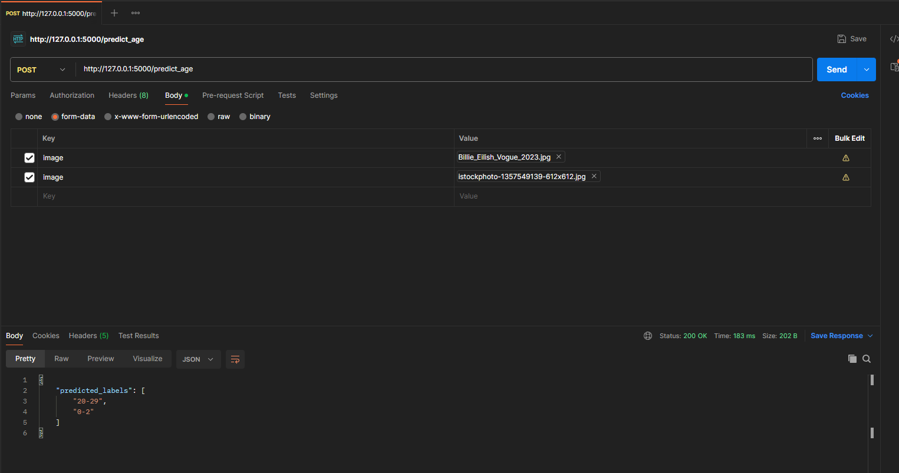

# ageprediction-flaskml
Exposing an age prediction neural network running via onnxruntime through a flask ml server endpoint
The underlying model is this age classifier https://huggingface.co/nateraw/vit-age-classifier

Instructions:

1. Clone this repo to your local machine using git clone <url>

2. Ensure you are at the root of the project, in ageprediction-flaskml directory

3. Install requirements with "pip install -r requirements.txt"

The expected file structure is now:

ageprediction-flaskml/
├── TestImages/              # Example images you can use to test the model
├── image-1.png              # Screenshot of example Postman call
├── model_server.py          # Main Flask-ML server file
├── vit_age_classifier.onnx  # ONNX model
├── requirements.txt         # Python dependencies
├── README.md                # Documentation (this file)

4. Run model_server.py with "py model_server.py"
    - This will run on port 5000 by default but optionally specify a port in the command line by appending --port {desired port}
    - For example "py model_server.py --port 5400" to open in port 5400

5. You can now access the endpoint locally at http://127.0.0.1:5000 endpoint "predict_age" (change 5000 to your custom port if used)
    - The images you upload must be PNG or JPEG

6. The endpoint can be used via any http requesting method. For example in Postman you can setup the following request format:
    - POST method
    - HTTP address "http://127.0.0.1:5000/predict_age"
    - Choose 'Body' as params, and form-data to upload images directly
    - For each image you want to process (you can do multiple at once) you have the key be "image" and the value be of type file, and upload your file directly
    - The return will be a JSON which contains an array of labels, which are the predicted age ranges of your uploaded photos

Example Postman request with results:
